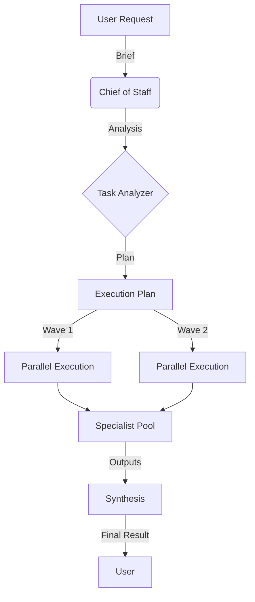

# Swarm Orchestration Guide

**Swarm Orchestration** (v2.2.0) transforms your static AI commands into a dynamic, multi-agent system. Instead of dispatching a request to a single "Strategy" or "Content" model, the system now coordinates a team of **66 specialized agents** to execute your task in parallel.

---

## 🐝 How It Works

When you run a command like `content` or `creative`, the following process occurs automatically:



1.  **Chief of Staff Analysis**: Your request is analyzed to understand the intent, context, and required skills.
2.  **Dynamic Staffing**: The system searches an index of **66 specialists** across 6 departments (Strategy, Tech, Content, Creative, Market, Internal) to find the perfect match for each sub-task.
3.  **Parallel Waves**: Tasks that can run simultaneously are grouped into "waves" for maximum speed.
4.  **Synthesis**: The Chief of Staff reviews all outputs and compiles them into a single, cohesive response.

---

## 🚀 Core Commands

These commands use the Swarm Engine by default. You don't need to change your workflow.

### 1. Content Creation (`content`)

**Use for:** Blog posts, guides, documentation, technical writing.

```bash
content "Write a comprehensive guide to Bash scripting for beginners"
```

### 2. Creative Studio (`creative`)

**Use for:** Storytelling, narrative design, world-building.

```bash
creative "A cyberpunk story about a rogue AI"
```

### 3. Strategy & Analysis Suite

**Now fully Swarm-Powered:**

- `market`: Market research & trends
- `brand`: Brand strategy & positioning
- `tech`: Technical analysis & code review
- `strategy`: High-level strategic planning
- `research`: Deep-dive synthesis
- `stoic`: Philosophical coaching
- `copy`: Marketing copywriting
- `narrative`: Store structure & pacing

### 4. Advanced Chaining (`dhp-chain`)

**Use for:** Manual pipelines where you want specific specialists in order.

```bash
dhp-chain market brand -- "Launch a product"
```

Or pipe explicit data:

```bash
cat market-report.md | brand
```

### 5. Observability Flags

All `content`, `creative`, and strategy commands now support enhanced observability:

```bash
# See exactly what's happening (waves, specialist assignment)
creative "Sci-fi story concept" --verbose

# Stream output as JSON events (for integrations)
market "Competitor analysis" --stream
```

---

## 🛠 Configuration & Model Control

The system is designed to be fully configurable via your `.env` file. You can swap out the "brain" behind any department without touching the code.

### Environment Variables

Each dispatcher alias maps to a specific variable in `.env`.

| Alias       | Variable         | Default Description                    |
| :---------- | :--------------- | :------------------------------------- |
| `tech`      | `TECH_MODEL`     | DeepSeek R1 (Reasoning expert)         |
| `content`   | `CONTENT_MODEL`  | Qwen3 Coder (Technical writing)        |
| `creative`  | `CREATIVE_MODEL` | Llama 4 Maverick (Storytelling)        |
| `copy`      | `CREATIVE_MODEL` | Llama 4 Maverick (Copywriting)         |
| `narrative` | `CREATIVE_MODEL` | Llama 4 Maverick (Narrative structure) |
| `strategy`  | `STRATEGY_MODEL` | Polaris Alpha (Reasoning & Planning)   |
| `brand`     | `STRATEGY_MODEL` | Polaris Alpha (Strategic positioning)  |
| `market`    | `MARKET_MODEL`   | Llama 4 Scout (Long-context analysis)  |
| `research`  | `RESEARCH_MODEL` | Gemma 3 9B (Knowledge synthesis)       |
| `stoic`     | `STOIC_MODEL`    | Gemma 3 9B (Philosophical coaching)    |

### How to Change a Model

1.  Open your `.env` file:
    ```bash
    nano ~/dotfiles/.env
    ```
2.  Find the variable you want to change (e.g., `TECH_MODEL`).
3.  Update the value to any OpenRouter model ID.

    ```bash
    # Example: Upgrade Tech Dispatcher to Claude 3.5 Sonnet
    TECH_MODEL="anthropic/claude-3.5-sonnet"
    ```

---

## ⚡️ Advanced Usage

### Python Wrapper (`bin/dhp-swarm.py`)

For granular control, you can use the Python wrapper directly. It now accepts the brief via **stdin** or as an argument (stdin preferred for large inputs).

```bash
# Run with debug logging (via argument)
uv run python bin/dhp-swarm.py "Your prompt" --verbose

# Run via stdin (Robust for large content)
cat large-report.md | uv run python bin/dhp-swarm.py --model "anthropic/claude-3-opus" --stream

# Force sequential execution (disable parallel waves)
echo "Prompt" | uv run python bin/dhp-swarm.py --no-parallel
```

---

## ❓ Troubleshooting

### "No API key found"

Ensure you have `OPENROUTER_API_KEY` set in your `~/dotfiles/.env` file.

### "Too many tasks for a simple request"

The Chief of Staff tries to be thorough. If it's over-engineering a simple question, try being more directive:

```bash
content "Just give me a quick list of 5 tips for X. Do not create a project plan."
```

### "Rate Limit Exceeded"

The swarm runs tasks in parallel, which can hit API rate limits on free tiers.
**Fix:** Increase the cooldown in your `.env`:

```bash
API_COOLDOWN_SECONDS=3
```
